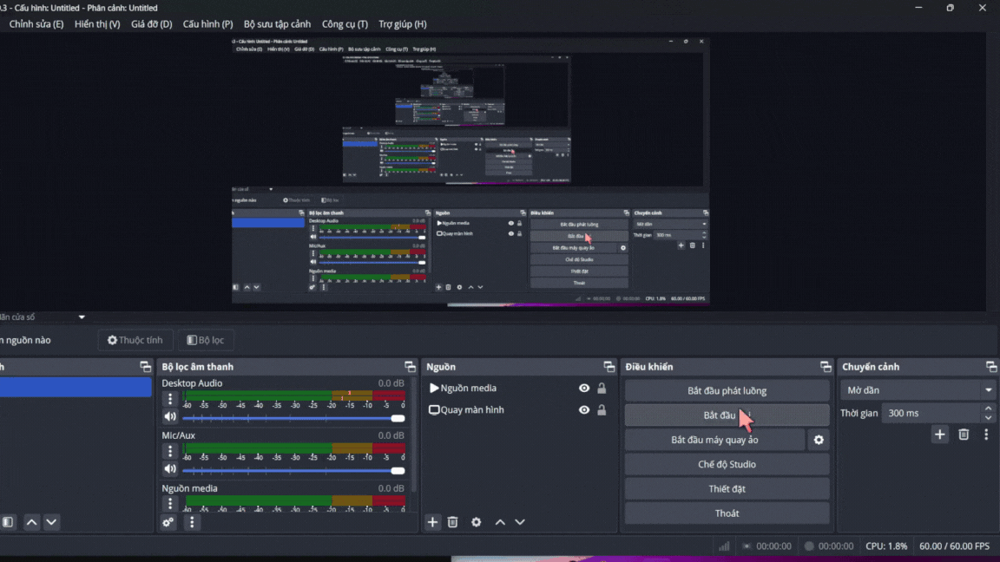
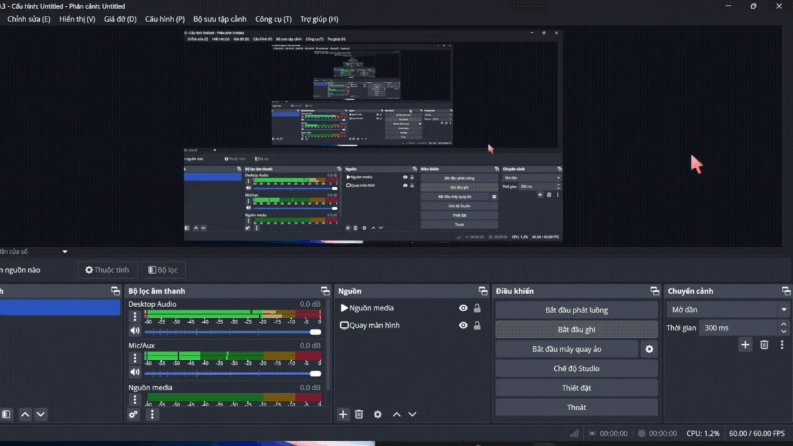
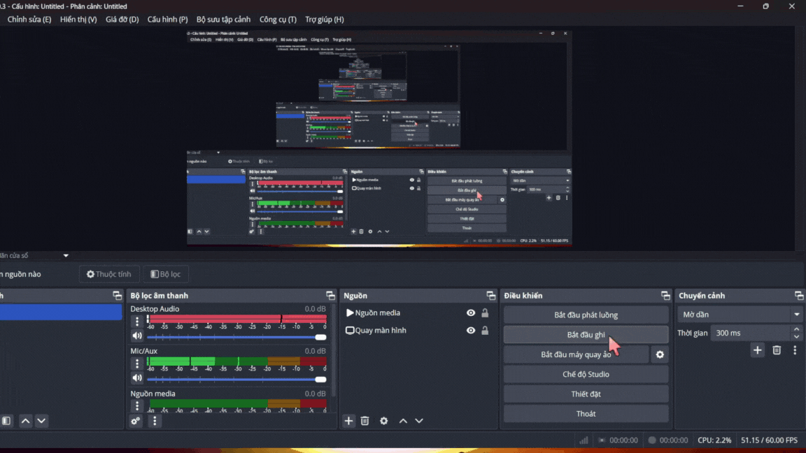
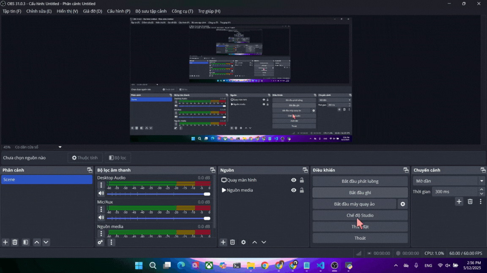
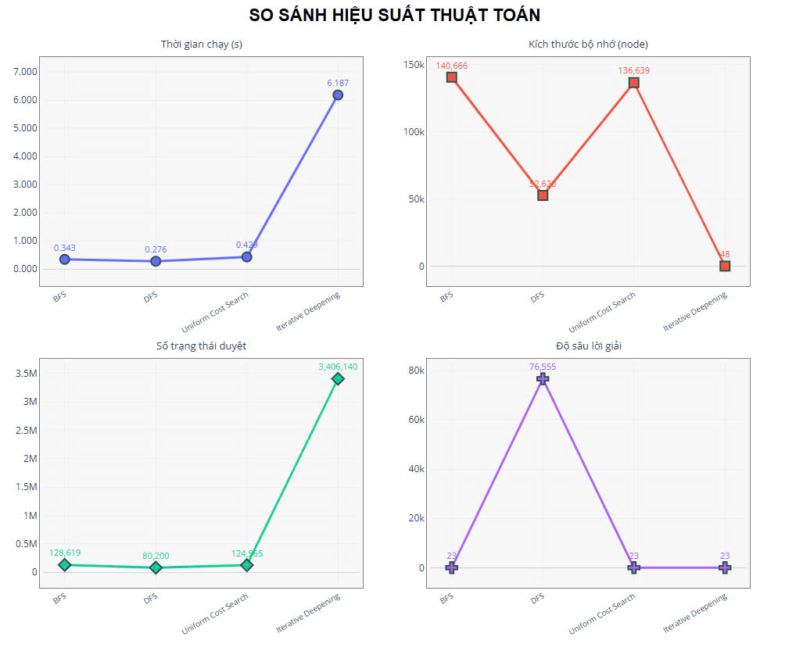
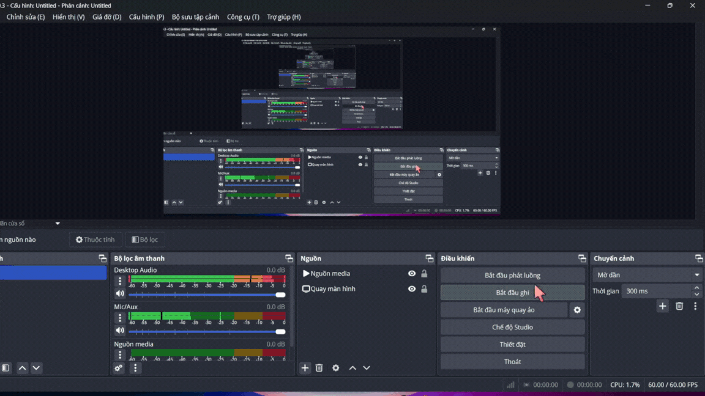
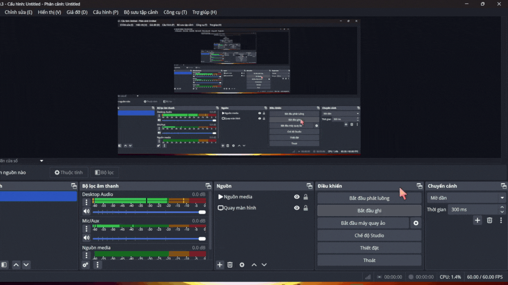
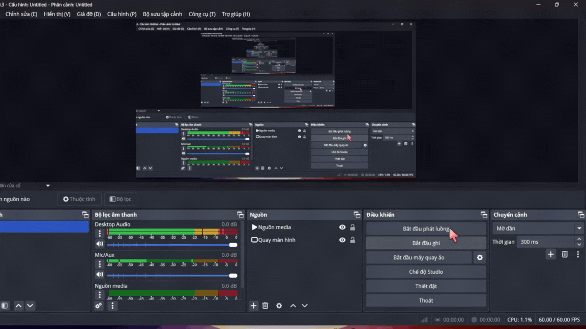
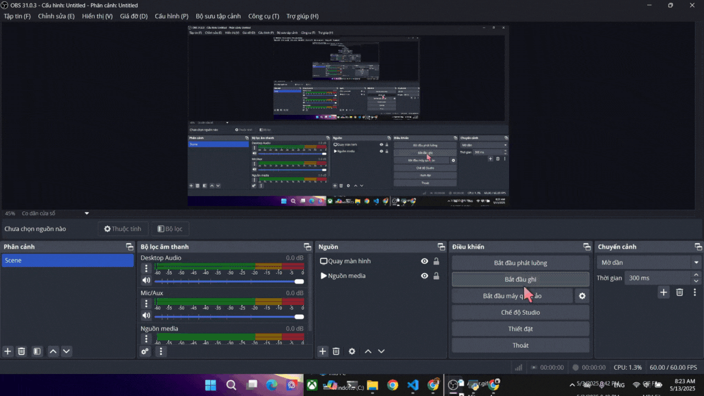
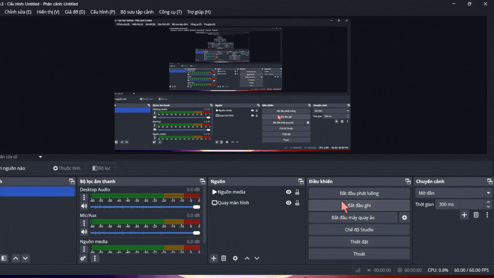

# 8_Puzzles_AI_Project

Kho lưu trữ này chứa dự án **8-Puzzle Solver with AI Algorithms** – một ứng dụng giải bài toán 8-puzzle cổ điển bằng nhiều thuật toán Trí tuệ Nhân tạo (AI) khác nhau. Dự án không chỉ triển khai các thuật toán tìm kiếm (uninformed & informed) mà còn hỗ trợ giao diện đồ họa thân thiện, giúp người dùng dễ dàng theo dõi quá trình giải và so sánh hiệu quả của các thuật toán.

Giảng viên hướng dẫn: TS.Phan Thị Huyền Trang

Sinh viên thực hiện: Trương Nhất Nguyên

Mã số sinh viên: 23110273

Mã lớp học: ARIN330585_04

## Mục lục
- [Mục tiêu](#mục-tiêu)
- [Thuật toán](#thuật-toán)
  - [Tìm kiếm không thông tin (Uninformed Search)](#tìm-kiếm-không-thông-tin-uninformed-search)
    - [Breadth-First Search (BFS)](#breadth-first-search-bfs)
    - [Depth-First Search (DFS)](#depth-first-search-dfs)
    - [Uniform Cost Search (UCS)](#uniform-cost-search-ucs)
    - [Iterative Deepening Search (IDS)](#iterative-deepening-search-ids)
    - [So sánh các thuật toán](#so-sánh-các-thuật-toán-trong-nhóm-tìm-kiếm-không-thông-tin)
  - [Tìm kiếm có thông tin (Informed Search)](#tìm-kiếm-có-thông-tin-informed-search)
    - [Greedy Best-First Search](#greedy-best-first-search)
    - [A* Search](#a-search)
    - [Iterative Deepening A* (IDA*)](#iterative-deepening-a-ida)
    - [Beam Search](#beam-search)
  - [Tìm kiếm cục bộ (Local Search)](#tìm-kiếm-cục-bộ-local-search)
    - [Simple Hill Climbing](#simple-hill-climbing)
    - [Stochastic Hill Climbing](#stochastic-hill-climbing)
    - [Simulated Annealing](#simulated-annealing)
    - [Genetic Search](#genetic-search)
  - [Tìm kiếm trong môi trường phức tạp (Complex Environment Search)](#tìm-kiếm-trong-môi-trường-phức-tạp-complex-environment-search)
    - [AND-OR Search Algorithm](#and-or-search-algorithm)
  - [Tìm kiếm có điều kiện ràng buộc (Non-deterministic Search)](#tìm-kiếm-không-xác-định-non-deterministic-search)
- [Tính năng giao diện (GUI Features)](#tính-năng-giao-diện-gui-features)

## 1.Mục tiêu

- **Triển khai các thuật toán AI**: Ứng dụng nhiều thuật toán tìm kiếm (uninformed, informed, local search, v.v.) để giải bài toán 8-puzzle, giúp người dùng hiểu rõ cách hoạt động và hiệu suất của từng thuật toán.
- **So sánh hiệu suất**: Phân tích và so sánh hiệu quả của các thuật toán về thời gian chạy, bộ nhớ sử dụng, và tính tối ưu của đường đi để hiểu rõ ưu/nhược điểm của từng thuật toán sử dụng.
- **Trực quan hóa**: Cung cấp giao diện đồ họa (GUI) để người dùng có thể theo dõi quá trình giải bài toán một cách trực quan.

## 2. Nội dung
Dự án **8-Puzzle Visualizer** triển khai bài toán 8-puzzle, một bài toán cổ điển trong Trí tuệ Nhân tạo, với mục tiêu sắp xếp các ô số từ trạng thái ban đầu về trạng thái mục tiêu thông qua việc di chuyển ô trống. Dự án tích hợp **sáu nhóm thuật toán** tìm kiếm, bao gồm:
- **Tìm kiếm không có thông tin** (Uninformed Search): Các thuật toán dựa trên khám phá mù, không sử dụng hàm thông tin heuristic.
- **Tìm kiếm có thông tin** (Informed Search): Các thuật toán sử dụng heuristic để hướng dẫn tìm kiếm một cách hiệu quả hơn.
- **Tìm kiếm có ràng buộc** (Constraint Satisfaction Problem): Các thuật toán giải bài toán bằng cách gán các giá trị thỏa mãn với các ràng buộc cho trước.
- **Tìm kiếm cục bộ** (Local Search): Các thuật toán cải thiện trạng thái dần dần dựa trên hàm đánh giá.
- **Tìm kiếm trong môi trường phức tạp** (Searching in complex environments): Các thuật toán xử lý các tình huống không xác định hoặc quan sát không đầy đủ.
- **Học tăng cường** (Reinforcement Learning): Các thuật toán học từ kinh nghiệm để tìm lời giải tối ưu.

Mỗi nhóm được trình bày chi tiết với:
- **Thành phần chính của bài toán**: Mô tả trạng thái, hành động, kiểm tra mục tiêu, và hàm heuristic (nếu có).
- **Lời giải**: Chuỗi trạng thái và hành động từ trạng thái ban đầu đến mục tiêu.
- **GIF minh họa**: Hình ảnh động thể hiện quá trình giải của từng thuật toán.
- **So sánh hiệu suất**: Bảng so sánh ghi lại thời gian thực thi và số lần mở rộng (expansions) để so sánh (cùng trạng thái ban đầu và mục tiêu).
- **Nhận xét**: Phân tích ưu điểm, nhược điểm và hiệu quả khi áp dụng vào bài toán 8-puzzle.

## Thuật toán

Dự án triển khai một loạt thuật toán AI đa dạng, được phân loại thành các nhóm sau:

### Tìm kiếm không thông tin (Uninformed Search)

#### Breadth-First Search (BFS)
- **Mô tả**: BFS (Tìm kiếm theo chiều rộng) là một thuật toán tìm kiếm không thông tin, khám phá tất cả các trạng thái theo từng cấp độ độ sâu, từ trạng thái ban đầu đến trạng thái mục tiêu. Thuật toán sử dụng hàng đợi (queue) để mở rộng các trạng thái theo thứ tự từ gần nhất đến xa nhất so với trạng thái ban đầu.
- **Phân tích lý thuyết**:
  - **Tính tối ưu**: BFS đảm bảo tìm ra con đường ngắn nhất đến trạng thái mục tiêu trong không gian tìm kiếm không có trọng số (như bài toán 8-puzzle), vì nó khám phá tất cả các trạng thái ở độ sâu hiện tại trước khi đi sâu hơn.
  - **Hoạt động**: Bắt đầu từ trạng thái ban đầu, BFS mở rộng tất cả các trạng thái con ở độ sâu 1, sau đó độ sâu 2, và tiếp tục cho đến khi tìm thấy trạng thái mục tiêu. Ví dụ, với trạng thái ban đầu `826514037`, BFS sẽ tìm đường đi ngắn nhất đến `123456780`.
  - **Quản lý vòng lặp**: Sử dụng tập hợp `visited` để tránh lặp lại trạng thái, ngăn ngừa vòng lặp vô hạn.
- **Ưu điểm**:
  - Đảm bảo tính tối ưu (đường đi ngắn nhất) trong không gian tìm kiếm không có trọng số.
  - Hoàn chỉnh (luôn tìm được giải pháp nếu nó tồn tại).
- **Nhược điểm**:
  - Tiêu tốn nhiều bộ nhớ vì phải lưu trữ tất cả các trạng thái ở độ sâu hiện tại.
  - Thời gian chạy có thể chậm nếu độ sâu của giải pháp lớn.
- **Độ phức tạp**:
  - **Thời gian**: \( O(b^d) \), trong đó \( b \) là nhánh trung bình (tối đa 4 trong 8-puzzle: lên, xuống, trái, phải), và \( d \) là độ sâu của trạng thái mục tiêu. Với 8-puzzle, \( b \) thường là 2-3 (do một số di chuyển không hợp lệ), và \( d \) có thể lên đến 31 (độ sâu tối đa cho một số trạng thái).
  - **Bộ nhớ**: \( O(b^d) \), vì BFS phải lưu trữ tất cả các trạng thái ở độ sâu hiện tại trong hàng đợi.
- **Hình ảnh minh họa**: 
- **Hình ảnh bổ sung**: 
- **Liên kết**: [Wikipedia - Breadth-first search](https://en.wikipedia.org/wiki/Breadth-first_search)
- **Nhận xét về hiệu suất khi áp dụng lên 8-Puzzle**:
  - **Tính tối ưu**: BFS luôn tìm được đường đi ngắn nhất, điều này rất quan trọng trong 8-puzzle khi người dùng cần giải pháp hiệu quả nhất. Tuy nhiên, với các trạng thái có độ sâu lớn, số lượng trạng thái cần duyệt rất lớn khiến thuật toán trở nên tốn kém.
  - **Thời gian chạy**: Trong các thử nghiệm, BFS mất khoảng 2-3 giây để giải quyết bài toán
  - **Bộ nhớ sử dụng**: BFS tiêu thụ nhiều bộ nhớ, do phải lưu trữ hàng đợi chứa tất cả các trạng thái chưa thăm.
  - **Tính thực tiễn**: BFS là lựa chọn lý tưởng khi cần đảm bảo giải pháp tối ưu và tài nguyên máy tính không phải là vấn đề. Tuy nhiên, trong 8-puzzle, hiệu suất giảm mạnh khi độ sâu tăng, do đó cần cân nhắc kết hợp với các kỹ thuật cắt tỉa hoặc chuyển sang thuật toán informed search nếu độ sâu lớn.

#### Depth-First Search (DFS)
- **Mô tả**: DFS (Tìm kiếm theo chiều sâu) là một thuật toán tìm kiếm không thông tin, khám phá sâu nhất một nhánh trước khi quay lui và thử nhánh khác. Thuật toán sử dụng ngăn xếp (stack) hoặc đệ quy để quản lý các trạng thái cần mở rộng.
- **Phân tích lý thuyết**:
  - **Tính tối ưu**: DFS không đảm bảo tìm ra con đường ngắn nhất, vì nó ưu tiên đi sâu vào một nhánh. Ví dụ, với trạng thái ban đầu `826514037`, DFS có thể tìm một đường đi dài hàng chục nghìn bước trước khi đạt `123456780`.
  - **Hoạt động**: Bắt đầu từ trạng thái ban đầu, DFS đi sâu vào một nhánh bằng cách chọn một hành động (lên, xuống, trái, phải) và tiếp tục cho đến khi gặp trạng thái không thể mở rộng hoặc đạt mục tiêu. Nếu không thành công, nó quay lui và thử nhánh khác.
  - **Quản lý vòng lặp**: Sử dụng tập hợp `visited` để tránh lặp lại trạng thái. Nếu không giới hạn độ sâu, DFS có thể dẫn đến tràn ngăn xếp (stack overflow).
- **Ưu điểm**:
  - Tiết kiệm bộ nhớ hơn BFS, vì chỉ lưu trữ các trạng thái trên nhánh hiện tại.
  - Có thể nhanh chóng tìm được giải pháp nếu nhánh đầu tiên chứa mục tiêu.
- **Nhược điểm**:
  - Không đảm bảo tính tối ưu (đường đi có thể rất dài).
  - Có nguy cơ tràn ngăn xếp nếu không giới hạn độ sâu.
  - Không hoàn chỉnh nếu không gian trạng thái có vòng lặp và không có cơ chế kiểm soát.
- **Độ phức tạp**:
  - **Thời gian**: \( O(b^d) \), trong đó \( b \) là nhánh trung bình (tối đa 4 trong 8-puzzle), và \( d \) là độ sâu tối đa của cây tìm kiếm (có thể lên đến \( 9! = 362,880 \) nếu không cắt tỉa).
  - **Bộ nhớ**: \( O(d) \), vì DFS chỉ lưu trữ các trạng thái trên nhánh hiện tại.
- **Hình ảnh minh họa**: 
- **Hình ảnh bổ sung**: 
- **Liên kết**: [Wikipedia - Depth-first search](https://en.wikipedia.org/wiki/Depth-first_search)
- **Nhận xét về hiệu suất khi áp dụng lên 8-Puzzle**:
  - **Tính tối ưu**: DFS thường không tìm được đường đi ngắn nhất trong 8-puzzle. Điều này làm DFS không phù hợp khi cần hiệu quả tối đa.
  - **Thời gian chạy**: DFS có thể rất nhanh nếu nhánh đầu tiên chứa mục tiêu hoặc độ sâu nhỏ. Tuy nhiên, nếu nhánh sai kéo dài, thời gian chạy có thể tăng lên hàng phút do phải quay lui nhiều lần. Điều này phụ thuộc mạnh vào thứ tự chọn nhánh.
  - **Bộ nhớ sử dụng**: DFS sử dụng rất ít bộ nhớ, vì chỉ lưu trữ nhánh hiện tại. Với 8-puzzle, điều này là lợi thế lớn trên các thiết bị có tài nguyên hạn chế, nhưng không giới hạn độ sâu có thể gây tràn ngăn xếp.
  - **Tính thực tiễn**: DFS phù hợp khi không quan tâm đến tính tối ưu và cần giải pháp nhanh với bộ nhớ hạn chế. Tuy nhiên, trong 8-puzzle, hiệu suất của DFS bị ảnh hưởng bởi khả năng đi lạc vào nhánh sâu, do đó cần giới hạn độ sâu để tránh tràn bộ nhớ hoặc vòng lặp vô hạn.

#### Uniform Cost Search (UCS)
- **Mô tả**: UCS (Tìm kiếm chi phí đồng nhất) là một thuật toán tìm kiếm không thông tin, mở rộng trạng thái dựa trên chi phí thấp nhất từ trạng thái ban đầu đến trạng thái hiện tại. Thuật toán sử dụng hàng đợi ưu tiên (priority queue) để chọn trạng thái có tổng chi phí thấp nhất.
- **Phân tích lý thuyết**:
  - **Tính tối ưu**: UCS đảm bảo tìm ra con đường có chi phí thấp nhất, ngay cả trong không gian tìm kiếm có trọng số. Trong 8-puzzle (mỗi di chuyển có chi phí 1), UCS tương tự BFS, đảm bảo đường đi ngắn nhất về số bước.
  - **Hoạt động**: UCS thêm tất cả trạng thái con vào hàng đợi ưu tiên với chi phí là số bước từ trạng thái ban đầu, và mở rộng trạng thái có chi phí thấp nhất trước. Ví dụ, với trạng thái ban đầu `826514037`, UCS sẽ tìm đường đi ngắn nhất đến `123456780`.
  - **Quản lý vòng lặp**: Sử dụng tập hợp `visited` và kiểm tra nếu một trạng thái được tìm thấy lại với chi phí thấp hơn để cập nhật đường đi.
- **Ưu điểm**:
  - Đảm bảo tính tối ưu trong không gian tìm kiếm có trọng số.
  - Hoàn chỉnh (luôn tìm được giải pháp nếu nó tồn tại).
- **Nhược điểm**:
  - Tiêu tốn nhiều bộ nhớ, tương tự BFS, vì phải lưu trữ tất cả trạng thái trong hàng đợi ưu tiên.
  - Có thể chậm nếu không gian trạng thái lớn và không có heuristic hỗ trợ.
- **Độ phức tạp**:
  - **Thời gian**: \( O(b^{C*/ε}) \), trong đó \( b \) là nhánh trung bình, \( C* \) là chi phí của đường đi tối ưu, và \( ε \) là chi phí nhỏ nhất của một bước (\( ε = 1 \) trong 8-puzzle, nên tương đương \( O(b^d) \)).
  - **Bộ nhớ**: \( O(b^{C*/ε}) \), tương tự BFS.
- **Hình ảnh minh họa**: 
- **Hình ảnh bổ sung**: 
- **Liên kết**: [GeeksforGeeks - Uniform Cost Search](https://www.geeksforgeeks.org/uniform-cost-search-ucs-in-ai/)
- **Nhận xét về hiệu suất khi áp dụng lên 8-Puzzle**:
  - **Tính tối ưu**: UCS đảm bảo tìm được đường đi ngắn nhất, tương tự BFS, nhờ sử dụng hàng đợi ưu tiên dựa trên chi phí. Điều này rất hữu ích trong 8-puzzle khi cần giải pháp tối ưu.
  - **Thời gian chạy**: UCS có thời gian chạy tương tự BFS, khoảng 2-3 giây cho trạng thái độ sâu trung bình, và tăng lên đáng kể với độ sâu lớn. Sự khác biệt với BFS là không đáng kể trong 8-puzzle do chi phí đồng nhất (1 cho mỗi bước).
  - **Bộ nhớ sử dụng**: UCS tiêu thụ nhiều bộ nhớ, tương tự BFS, do phải lưu trữ hàng đợi ưu tiên.
  - **Tính thực tiễn**: UCS là lựa chọn tốt khi cần giải pháp tối ưu và chi phí không đồng đều, nhưng trong 8-puzzle (chi phí đồng nhất), hiệu quả không vượt trội so với BFS. Việc sử dụng hàng đợi ưu tiên có thể làm tăng chi phí tính toán so với BFS thông thường, do đó BFS thường được ưu tiên hơn.

#### Iterative Deepening Search (IDS)
- **Mô tả**: IDS (Tìm kiếm lặp sâu dần) là một thuật toán tìm kiếm không thông tin, kết hợp lợi ích của BFS và DFS. IDS thực hiện tìm kiếm theo chiều sâu (DFS) nhiều lần, mỗi lần với giới hạn độ sâu tăng dần, cho đến khi tìm thấy trạng thái mục tiêu.
- **Phân tích lý thuyết**:
  - **Tính tối ưu**: IDS đảm bảo tìm ra con đường ngắn nhất trong không gian tìm kiếm không có trọng số, tương tự BFS, vì nó lặp lại tìm kiếm với độ sâu tăng dần.
  - **Hoạt động**: IDS bắt đầu với giới hạn độ sâu 0, thực hiện DFS với giới hạn này. Nếu không tìm thấy mục tiêu, tăng giới hạn lên 1 và lặp lại. Ví dụ, với trạng thái ban đầu `826514037`, IDS sẽ tìm đường đi ngắn nhất đến `123456780`.
  - **Quản lý vòng lặp**: Sử dụng tập hợp `visited` trong mỗi lần lặp để tránh lặp lại trạng thái.
- **Ưu điểm**:
  - Đảm bảo tính tối ưu (đường đi ngắn nhất) như BFS.
  - Tiết kiệm bộ nhớ hơn BFS, chỉ lưu trữ các trạng thái trên nhánh hiện tại.
  - Hoàn chỉnh nếu không gian trạng thái hữu hạn.
- **Nhược điểm**:
  - Thời gian chạy chậm hơn BFS do lặp lại nhiều lần, dẫn đến duyệt lại các trạng thái ở độ sâu thấp hơn.
  - Có thể không hiệu quả nếu độ sâu giải pháp lớn.
- **Độ phức tạp**:
  - **Thời gian**: \( O(b^d) \), nhưng chậm hơn BFS do lặp lại nhiều lần. Tổng số trạng thái duyệt qua là \( (b^0 + b^1 + \dots + b^d) \).
  - **Bộ nhớ**: \( O(bd) \), tương tự DFS, tiết kiệm hơn BFS.
- **Hình ảnh minh họa**: 
- **Liên kết**: [GeeksforGeeks - Iterative Deepening Search](https://www.geeksforgeeks.org/iterative-deepening-searchids-iterative-deepening-depth-first-searchiddfs/)
- **Nhận xét về hiệu suất khi áp dụng lên 8-Puzzle**:
  - **Tính tối ưu**: IDS đảm bảo tìm được đường đi ngắn nhất, tương tự BFS, nhờ cơ chế lặp với độ sâu tăng dần. Điều này làm IDS trở thành lựa chọn đáng tin cậy khi cần giải pháp tối ưu.
  - **Thời gian chạy**: IDS có thời gian chạy chậm hơn BFS, khoảng 3-5 giây cho trạng thái độ sâu trung bình, và có thể lên đến hàng phút với độ sâu lớn , do phải lặp lại nhiều lần. 
  - **Bộ nhớ sử dụng**: IDS tiêu thụ ít bộ nhớ hơn BFS, vì chỉ lưu trữ nhánh hiện tại trong mỗi lần lặp. Điều này là lợi thế lớn trong 8-puzzle.
  - **Tính thực tiễn**: IDS là giải pháp cân bằng giữa tính tối ưu và tiết kiệm bộ nhớ. Tuy nhiên, thời gian chạy dài hơn BFS làm giảm hiệu quả khi độ sâu tăng, do đó nên kết hợp với các giới hạn độ sâu hợp lý để tối ưu hóa.

#### So sánh các thuật toán trong nhóm Tìm kiếm không thông tin

Dưới đây là so sánh hiệu suất của các thuật toán tìm kiếm không thông tin (BFS, DFS, UCS, IDS) khi áp dụng vào bài toán 8-puzzle, dựa trên các tiêu chí: **tính tối ưu**, **thời gian chạy**, **bộ nhớ sử dụng**, và **tính thực tiễn**.

- **Hình ảnh so sánh hiệu suất**: 

### Tìm kiếm có thông tin (Informed Search)

#### Greedy Best-First Search
- **Mô tả**: Greedy Best-First Search là một thuật toán tìm kiếm có thông tin, sử dụng hàm heuristic để định hướng tìm kiếm, ưu tiên mở rộng trạng thái có giá trị heuristic thấp nhất (ước lượng chi phí từ trạng thái hiện tại đến mục tiêu). Thuật toán sử dụng hàng đợi ưu tiên (priority queue) để chọn trạng thái tiếp theo.
- **Phân tích lý thuyết**:
  - **Tính tối ưu**: Greedy Best-First Search **không đảm bảo** tìm ra con đường ngắn nhất, vì nó chỉ dựa vào giá trị heuristic mà không xem xét chi phí đã đi. Ví dụ, với trạng thái ban đầu `217304865`, Greedy Best-First Search có thể tìm một đường đi dài hơn 24 bước (kết quả tối ưu của BFS), chẳng hạn 30 bước.
  - **Hàm heuristic**: Sử dụng **khoảng cách Manhattan**, tính tổng khoảng cách thẳng (theo hàng và cột) của mỗi ô từ vị trí hiện tại đến vị trí mục tiêu, bỏ qua ô trống.
  - **Hoạt động**: Tính giá trị heuristic cho các trạng thái con và chọn trạng thái có giá trị thấp nhất để mở rộng. Ví dụ, với trạng thái `217304865`, thuật toán ưu tiên di chuyển ô trống để giảm khoảng cách Manhattan.
  - **Quản lý vòng lặp**: Sử dụng tập hợp `visited` để tránh lặp lại trạng thái.
- **Ưu điểm**:
  - Nhanh hơn các thuật toán không thông tin (như BFS, DFS) nhờ sử dụng heuristic.
  - Tiêu tốn ít bộ nhớ hơn BFS nếu heuristic tốt, vì chỉ tập trung vào các trạng thái "hứa hẹn".
- **Nhược điểm**:
  - Không đảm bảo tính tối ưu (đường đi có thể dài hơn tối ưu).
  - Hiệu quả phụ thuộc nhiều vào chất lượng của heuristic; nếu heuristic không tốt, có thể bị mắc kẹt.
- **Độ phức tạp**:
  - **Thời gian**: \( O(b^d) \), trong đó \( b \) là nhánh trung bình, và \( d \) là độ sâu tối đa của cây tìm kiếm. Phụ thuộc vào chất lượng heuristic.
  - **Bộ nhớ**: \( O(b^d) \), nhưng thường ít hơn BFS nếu heuristic hiệu quả.
- **Hình ảnh minh họa**: 
- **Hình ảnh bổ sung**: 
- **Liên kết**: [GeeksforGeeks - Greedy Best-First Search](https://www.geeksforgeeks.org/greedy-best-first-search-algorithm/)

#### A* Search
- **Mô tả**: A* Search là một thuật toán tìm kiếm có thông tin, kết hợp chi phí đã đi \( g \) (từ trạng thái ban đầu đến trạng thái hiện tại) với giá trị heuristic \( h \) (ước lượng chi phí từ trạng thái hiện tại đến mục tiêu) để tìm đường đi tối ưu. Thuật toán sử dụng hàng đợi ưu tiên (priority queue) để chọn trạng thái có giá trị \( f = g + h \) thấp nhất.
- **Phân tích lý thuyết**:
  - **Tính tối ưu**: A* đảm bảo tìm ra con đường ngắn nhất trong không gian tìm kiếm không có trọng số, miễn là hàm heuristic \( h \) là **admissible** (không bao giờ ước lượng quá chi phí thực tế) và **consistent** (tuân theo bất đẳng thức tam giác: \( h(n) \leq c(n, n') + h(n') \)). Trong dự án này, khoảng cách Manhattan là admissible và consistent, nên A* luôn tối ưu.
  - **Hàm heuristic**: Sử dụng **khoảng cách Manhattan** làm hàm \( h \). Chi phí \( g \) là số bước từ trạng thái ban đầu (mỗi bước có chi phí 1). Ví dụ, với trạng thái ban đầu `217304865`, nếu một trạng thái con có \( g = 5 \) và \( h = 10 \), thì \( f = 15 \).
  - **Hoạt động**: A* tính \( f = g + h \) cho mỗi trạng thái con và chọn trạng thái có \( f \) thấp nhất để mở rộng. Với trạng thái `217304865`, A* sẽ tìm đường đi ngắn nhất (24 bước, giống BFS), nhưng nhanh hơn nhờ heuristic.
  - **Quản lý vòng lặp**: Sử dụng tập hợp `visited`, nhưng A* cũng kiểm tra nếu một trạng thái được tìm thấy lại với \( f \) thấp hơn để cập nhật đường đi.
- **Ưu điểm**:
  - Đảm bảo tính tối ưu (đường đi ngắn nhất) nếu heuristic là admissible và consistent.
  - Hiệu quả hơn BFS và UCS nhờ heuristic định hướng tìm kiếm, giảm số trạng thái cần duyệt.
  - Hoàn chỉnh (luôn tìm được giải pháp nếu nó tồn tại).
- **Nhược điểm**:
  - Tiêu tốn nhiều bộ nhớ, vì phải lưu trữ tất cả trạng thái trong hàng đợi ưu tiên.
  - Thời gian chạy phụ thuộc vào chất lượng heuristic; nếu heuristic kém, hiệu suất có thể giảm.
- **Độ phức tạp**:
  - **Thời gian**: \( O(b^d) \), nhưng thường nhanh hơn BFS nhờ heuristic. Số trạng thái duyệt qua phụ thuộc vào chất lượng của \( h \).
  - **Bộ nhớ**: \( O(b^d) \), tương tự BFS, nhưng số trạng thái lưu trữ thường ít hơn nhờ heuristic.
- **Hình ảnh minh họa**: 
- **Hình ảnh bổ sung**: 
- **Liên kết**: [GeeksforGeeks - A* Search Algorithm](https://www.geeksforgeeks.org/a-search-algorithm/)

#### Iterative Deepening A* (IDA*)
- **Mô tả**: IDA* (Tìm kiếm lặp sâu dần A*) là một biến thể của A*, kết hợp ý tưởng lặp sâu dần (như IDS) với tìm kiếm có thông tin của A*. Thuật toán sử dụng ngưỡng \( f = g + h \) để giới hạn độ sâu tìm kiếm, tăng dần ngưỡng cho đến khi tìm thấy mục tiêu.
- **Phân tích lý thuyết**:
  - **Tính tối ưu**: IDA* đảm bảo tính tối ưu nếu heuristic là admissible(không đánh giá thấp) và consistent (đơn điệu), tương tự A*.
  - **Hoạt động**: Bắt đầu với ngưỡng ban đầu là \( f \) của trạng thái ban đầu, IDA* thực hiện tìm kiếm theo chiều sâu (DFS) với giới hạn là ngưỡng này. Nếu không tìm thấy mục tiêu, tăng ngưỡng lên giá trị f nhỏ nhất vượt quá ngưỡng hiện tại và lặp lại.
  - **Quản lý vòng lặp**: Sử dụng cơ chế tương tự IDS, nhưng dựa trên giá trị \( f \).
- **Ưu điểm**:
  - Tiết kiệm bộ nhớ hơn A*, vì chỉ lưu trữ các trạng thái trên nhánh hiện tại.
  - Đảm bảo tính tối ưu nếu heuristic là admissible và consistent.
- **Nhược điểm**:
  - Thời gian chạy có thể chậm hơn A* do lặp lại nhiều lần. Vì nó lặp lại theo ngưỡng, có thể mở rộng nhiều node giống nhau ở mỗi vòng lặp. Dẫn đến tốn thời gian hơn A*.
  - Hiệu quả phụ thuộc vào chất lượng heuristic.
- **Độ phức tạp**:
  - **Thời gian**: \( O(b^d) \), nhưng có thể chậm hơn A* do lặp lại.
  - **Bộ nhớ**: \( O(d) \), tiết kiệm hơn A*.
- **Hình ảnh minh họa**: 
- **Liên kết**: [GeeksforGeeks - Iterative Deepening A*](https://www.geeksforgeeks.org/iterative-deepening-a-algorithm-ida-artificial-intelligence/)

#### Beam Search
- **Mô tả**: Beam Search là một thuật toán tìm kiếm có thông tin, giới hạn số lượng trạng thái được giữ lại tại mỗi bước (gọi là "beam width"). Thuật toán chỉ giữ lại \( k \) trạng thái tốt nhất (dựa trên heuristic) để mở rộng ở bước tiếp theo.
- **Phân tích lý thuyết**:
  - **Tính tối ưu**: Beam Search không đảm bảo tính tối ưu, vì nó cắt bỏ nhiều trạng thái tiềm năng.
  - **Hoạt động**: Tại mỗi bước, Beam Search mở rộng tất cả trạng thái con của \( k \) trạng thái tốt nhất, sau đó chỉ giữ lại \( k \) trạng thái có giá trị heuristic tốt nhất.
  - **Quản lý vòng lặp**: Sử dụng cơ chế giới hạn số trạng thái để tránh lặp vô hạn.
- **Ưu điểm**:
  - Tiết kiệm bộ nhớ hơn A* và Greedy Best-First Search, vì chỉ lưu trữ \( k \) trạng thái tại mỗi bước.
  - Nhanh hơn nếu \( k \) nhỏ, phù hợp với các bài toán lớn.
  - Điều chỉnh linh hoạt, beamwidth(k) nhỏ thì nhanh, lớn thì chính xác hơn - dễ dàng cân bằng giữa tốc độ và độ chính xác
- **Nhược điểm**:
  - Không đảm bảo tính tối ưu, có thể bỏ qua đường đi tốt nhất do giới hạn \( k \).
  - Nếu đi sai hướng thì không thể quay đầu
  - Hiệu quả phụ thuộc vào giá trị \( k \) và chất lượng heuristic.
- **Độ phức tạp**:
  - **Thời gian**: Phụ thuộc vào \( k \), thường nhỏ hơn \( O(b^d) \).  => O(kbd) mỗi node tạo tối đa b con, trong d tầng
  - **Bộ nhớ**: \( O(k) \), rất tiết kiệm.
- **Hình ảnh bổ sung**: 
- **Hình ảnh minh họa**: 
- **Liên kết**: [GeeksforGeeks - Beam Search](https://www.geeksforgeeks.org/introduction-to-beam-search-algorithm/)

### Tìm kiếm cục bộ (Local Search)

#### Simple Hill Climbing
- **Mô tả**: Simple Hill Climbing là một thuật toán tìm kiếm cục bộ, luôn chọn trạng thái con có giá trị heuristic tốt hơn trạng thái hiện tại, di chuyển theo hướng tăng dần giá trị heuristic.
- **Phân tích lý thuyết**:
  - **Tính tối ưu**: Không đảm bảo tính tối ưu, dễ bị mắc kẹt tại cực trị cục bộ.
  - **Hoạt động**: Từ trạng thái ban đầu, chọn trạng thái con tốt nhất đầu tiên(dựa trên heuristic) và lặp lại cho đến khi không còn trạng thái con nào tốt hơn.
- **Ưu điểm**:
  - Rất nhanh, vì chỉ xem xét các trạng thái lân cận.
  - Tiết kiệm bộ nhớ, chỉ lưu trữ trạng thái hiện tại.
- **Nhược điểm**:
  - Dễ bị mắc kẹt tại cực trị cục bộ, bỏ qua giải pháp toàn cục.
  - Không đảm bảo tính tối ưu hoặc hoàn chỉnh.
- **Độ phức tạp**:
  - **Thời gian**: Phụ thuộc vào số lần lặp, thường rất nhanh.
  - **Bộ nhớ**: \( O(1) \), chỉ lưu trữ trạng thái hiện tại.
- **Hình ảnh minh họa**: 
- **Liên kết**: [GeeksforGeeks - Hill Climbing](https://www.geeksforgeeks.org/introduction-hill-climbing-artificial-intelligence/)

#### Stochastic Hill Climbing
- **Mô tả**: Stochastic Hill Climbing là biến thể của Hill Climbing, chọn trạng thái con ngẫu nhiên (nhưng vẫn ưu tiên trạng thái tốt hơn), nhằm tránh mắc kẹt tại cực trị cục bộ.
- **Phân tích lý thuyết**:
  - **Tính tối ưu**: Vẫn không đảm bảo tính tối ưu, nhưng có khả năng thoát khỏi cực trị cục bộ tốt hơn Simple Hill Climbing.
  - **Hoạt động**: Chọn ngẫu nhiên một trạng thái con và chỉ chấp nhận nếu nó tốt hơn trạng thái hiện tại.
- **Ưu điểm**:
  - Có khả năng thoát khỏi cực trị cục bộ tốt hơn Simple Hill Climbing.
  - Vẫn nhanh và tiết kiệm bộ nhớ.
- **Nhược điểm**:
  - Không đảm bảo tính tối ưu hoặc hoàn chỉnh.
  - Hiệu quả phụ thuộc vào yếu tố ngẫu nhiên.
- **Tối ưu hóa**:
  - Điều chỉnh xác suất chọn trạng thái con để cân bằng giữa khám phá và khai thác.
  - Kết hợp với Random Restarts để tăng cơ hội tìm giải pháp tốt.
- **Độ phức tạp**:
  - **Thời gian**: Tương tự Simple Hill Climbing, phụ thuộc vào số lần lặp.
  - **Bộ nhớ**: \( O(1) \).
- **Hình ảnh minh họa**: 
- **Liên kết**: [Wikipedia - Stochastic Hill Climbing](https://en.wikipedia.org/wiki/Hill_climbing#Variants)

#### Simulated Annealing
- **Mô tả**: Simulated Annealing là một thuật toán tìm kiếm cục bộ, mô phỏng quá trình làm nguội kim loại, chấp nhận các bước xấu (trạng thái con tệ hơn) với xác suất giảm dần để thoát khỏi cực trị cục bộ.
- **Phân tích lý thuyết**:
  - **Tính tối ưu**: Có thể đạt được giải pháp tối ưu nếu lịch làm nguội (schedule) đủ chậm, nhưng không đảm bảo trong thực tế.
  - **Hoạt động**: Bắt đầu từ trạng thái ban đầu, chọn ngẫu nhiên một trạng thái con. Nếu trạng thái con tốt hơn, chấp nhận; nếu tệ hơn, chấp nhận với xác suất dựa trên "nhiệt độ" hiện tại.
- **Ưu điểm**:
  - Có khả năng thoát khỏi cực trị cục bộ, tăng cơ hội tìm giải pháp toàn cục.
  - Linh hoạt, có thể điều chỉnh lịch làm nguội để cân bằng tốc độ và chất lượng.
- **Nhược điểm**:
  - Hiệu quả phụ thuộc vào lịch làm nguội; nếu làm nguội quá nhanh, có thể bị mắc kẹt.
  - Không đảm bảo tính tối ưu hoặc hoàn chỉnh trong thời gian hữu hạn.
- **Độ phức tạp**:
  - **Thời gian**: Phụ thuộc vào số lần lặp và lịch làm nguội.
  - **Bộ nhớ**: \( O(1) \), chỉ lưu trữ trạng thái hiện tại.
- **Hình ảnh minh họa**: 
- **Liên kết**: [Wikipedia - Simulated Annealing](https://en.wikipedia.org/wiki/Simulated_annealing)

#### Genetic Search
- **Mô tả**: Genetic Search (hay Genetic Algorithm - GA) là một thuật toán tối ưu hóa dựa trên tiến hóa sinh học, mô phỏng quá trình chọn lọc tự nhiên. Nó sử dụng quần thể các giải pháp tiềm năng, áp dụng các toán tử di truyền (lai ghép, đột biến) để tiến hóa qua các thế hệ, nhằm tìm kiếm giải pháp tối ưu hoặc gần tối ưu.
- **Phân tích lý thuyết**:
  - **Tính tối ưu**: GA không đảm bảo tìm được giải pháp tối ưu toàn cục, nhưng có khả năng tìm giải pháp gần tối ưu nhờ cơ chế khám phá không gian giải pháp song song và đa dạng di truyền.
  - **Hoạt động**: Bắt đầu với một quần thể ngẫu nhiên, đánh giá mức độ thích nghi (fitness) của từng cá thể, sau đó lặp lại các bước: lựa chọn cá thể tốt, lai ghép để tạo cá thể con, đột biến để tăng đa dạng, và thay thế quần thể cũ bằng thế hệ mới.
- **Ưu điểm**:
  - Khả năng khám phá không gian giải pháp lớn và phức tạp, phù hợp với các bài toán không khả vi hoặc không gian tìm kiếm không liên tục.
  - Có khả năng thoát khỏi cực trị cục bộ nhờ đa dạng di truyền từ lai ghép và đột biến.
  - Linh hoạt, có thể áp dụng cho nhiều bài toán bằng cách điều chỉnh cách mã hóa và hàm fitness.
- **Nhược điểm**:
  - Hiệu quả phụ thuộc vào tham số (kích thước quần thể, tỷ lệ lai ghép, đột biến); điều chỉnh không tốt có thể dẫn đến hội tụ sớm hoặc phân tán.
  - Tốn tài nguyên tính toán do phải đánh giá fitness cho toàn bộ quần thể qua nhiều thế hệ.
  - Không đảm bảo tìm được giải pháp tối ưu trong thời gian hữu hạn, đặc biệt với các bài toán có không gian giải pháp rất lớn.
- **Độ phức tạp**:
  - **Thời gian**: \( O(G.F.P) \), trong đó \( G \) là số thế hệ, \( F \) là độ phức tạp của hàm fitness, \( P \) là kích thước quần thể.
  - **Bộ nhớ**: \( O(P.L) \), trong đó \( P \) là kích thước quần thể, \( L \) là độ dài của mỗi cá thể (chromosome).
- **Hình ảnh minh họa**: 
- **Liên kết**: [Wikipedia - Genetic Search](https://www.geeksforgeeks.org/genetic-algorithms/)
### Tìm kiếm không xác định (Non-deterministic Search)

#### AND-OR Search Algorithm
- **Mô tả**: AND-OR Search là một thuật toán tìm kiếm không xác định, xử lý các bài toán có nhánh AND/OR, thường được sử dụng trong không gian tìm kiếm không xác định (như bài toán với các luật hoặc điều kiện phức tạp).
- **Phân tích lý thuyết**:
  - **Tính tối ưu**: Phụ thuộc vào cách triển khai, không luôn đảm bảo tính tối ưu.
  - **Hoạt động**: Xây dựng một cây tìm kiếm với các nút AND (yêu cầu tất cả điều kiện con phải đúng) và OR (chỉ cần một điều kiện con đúng), tìm kiếm giải pháp thỏa mãn tất cả điều kiện.
  - **Quản lý vòng lặp**: Sử dụng cơ chế kiểm tra trạng thái để tránh lặp vô hạn.
- **Ưu điểm**:
  - Phù hợp với các bài toán không xác định hoặc có nhiều điều kiện phức tạp.
  - Linh hoạt trong việc xử lý các không gian tìm kiếm phức tạp.
- **Nhược điểm**:
  - Phức tạp trong triển khai và có thể tiêu tốn nhiều tài nguyên nếu không gian trạng thái lớn.
  - Không đảm bảo tính tối ưu hoặc hoàn chỉnh nếu không được thiết kế cẩn thận.
- **Tối ưu hóa**:
  - Sử dụng heuristic để định hướng tìm kiếm, giảm số trạng thái cần duyệt.
  - Kết hợp với kỹ thuật cắt tỉa để loại bỏ các nhánh không hứa hẹn.
- **Độ phức tạp**:
  - **Thời gian**: Phụ thuộc vào cấu trúc của không gian tìm kiếm, có thể lên đến \( O(b^d) \).
  - **Bộ nhớ**: Phụ thuộc vào cách triển khai, thường là \( O(b^d) \).
- **Hình ảnh minh họa**: 
- **Liên kết**: [Wikipedia - AND-OR Search](https://en.wikipedia.org/wiki/AND%E2%80%93OR_search_algorithm)

## Tính năng giao diện (GUI Features)
- **Giao diện hiện đại, thân thiện với người dùng**: Được xây dựng bằng Tkinter, cung cấp trải nghiệm trực quan.
- **Trực quan hóa trạng thái và chuyển tiếp**: Hiển thị các trạng thái của bàn cờ và quá trình chuyển đổi giữa các bước.
- **Hoạt hình giải pháp**: Cho phép xem trực tiếp quá trình giải với hiệu ứng động.
- **Tốc độ hoạt hình có thể điều chỉnh**: Người dùng có thể thay đổi tốc độ hiển thị.
- **Tạo trạng thái ban đầu ngẫu nhiên**: Tạo bảng 8-puzzle ngẫu nhiên để thử nghiệm.
- **Thực thi từng bước**: Cho phép xem giải pháp từng bước một.
- **Hiển thị nhật ký thực thi và đường đi**: Cung cấp thông tin chi tiết về hiệu suất và đường đi của thuật toán.
